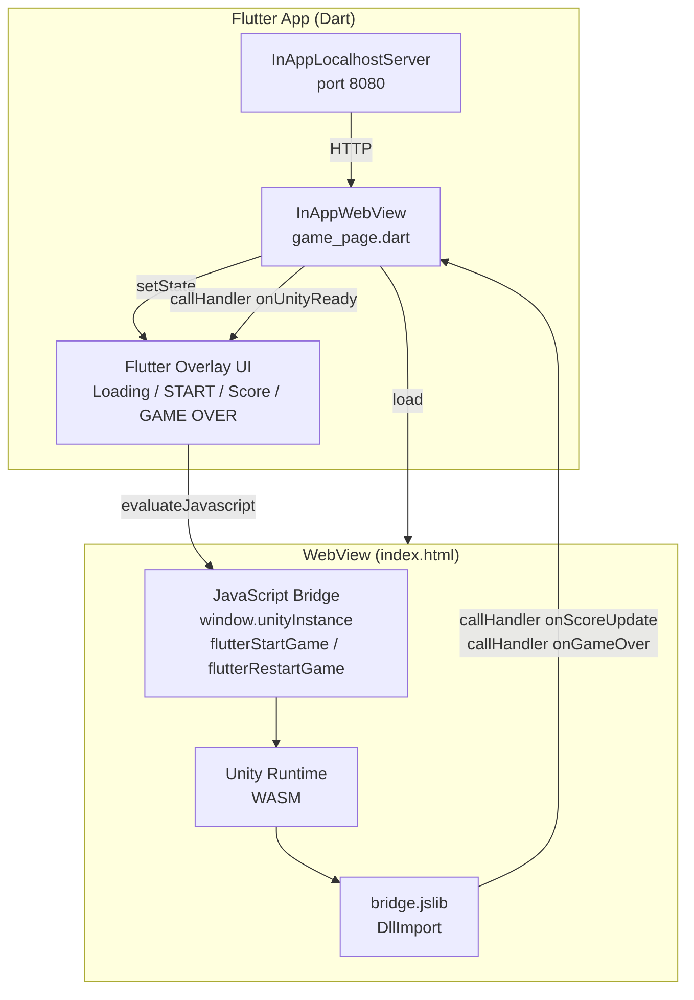

# Flutter × Unity WebGL — Tap Runner

> Flutter 앱 안에 Unity WebGL 게임을 임베드하고, 양방향 JavaScript 브리지로 연결한 포트폴리오 프로젝트입니다.

---

## 아키텍처



### 브리지 흐름

| 방향 | 트리거 | 경로 |
|------|--------|------|
| Flutter → Unity | START / RESTART 버튼 | `evaluateJavascript` → `flutterStartGame()` → `unityInstance.SendMessage('GameManager', ...)` |
| Unity → Flutter | 점수 업데이트 | C# `DllImport` → `bridge.jslib` → `callHandler('onScoreUpdate')` → `setState` |
| Unity → Flutter | 게임 오버 | C# `DllImport` → `bridge.jslib` → `callHandler('onGameOver')` → `setState` |

---

## 기술 스택

| 레이어 | 기술 |
|--------|------|
| 모바일 앱 | Flutter 3.x (Dart) |
| WebView | flutter_inappwebview ^6.1.5 |
| 게임 엔진 | Unity 6 (6000.4.3f1) |
| 빌드 타겟 | WebGL (compression=Disabled, threading=false) |
| JS 브리지 | Unity .jslib + InAppWebView JS Handler |
| 로컬 서버 | InAppLocalhostServer (port 8080) |

---

## 프로젝트 구조

```
flutter-unity-webgl-game/
├── unity-game/
│   ├── Assets/
│   │   ├── Scripts/
│   │   │   ├── GameManager.cs        # 게임 상태 관리, 점수, Flutter 브리지 DllImport
│   │   │   ├── PlayerController.cs   # Rigidbody2D 점프, 지면 감지, 충돌 처리
│   │   │   ├── ObstacleSpawner.cs    # 오브젝트 풀링, 속도 램프 (6→12 m/s / 30s)
│   │   │   ├── ObstacleMover.cs      # 좌측 스크롤, 풀 자동 반환
│   │   │   └── BackgroundScroller.cs # 두 패널 시차 스크롤
│   │   ├── Editor/
│   │   │   ├── SceneSetup.cs         # 씬 전체를 코드로 생성 (Inspector 불필요)
│   │   │   ├── WebGLBuildScript.cs   # WebGL 빌드 설정 적용
│   │   │   └── BatchBuild.cs         # -executeMethod CLI 진입점
│   │   └── Plugins/WebGL/
│   │       └── bridge.jslib          # Unity → Flutter JS 함수 정의
│   ├── Builds/WebGL/                 # 빌드 결과물 (35MB)
│   └── Packages/manifest.json        # com.unity.ugui 2.0.0 포함
│
└── flutter-app/
    ├── lib/
    │   ├── main.dart                 # 가로 orientation 고정, 앱 진입점
    │   └── game_page.dart            # WebView + JS 브리지 + Flutter 오버레이 UI
    ├── assets/unity/
    │   ├── index.html                # Flutter/브라우저 모드 자동 분기
    │   └── Build/                    # WebGL.loader.js / .framework.js / .data / .wasm
    ├── android/AndroidManifest.xml   # INTERNET 권한
    └── ios/Runner/Info.plist         # NSAllowsLocalNetworking
```

---

## 실행 방법

### 브라우저에서 Unity 게임 단독 확인

```bash
cd unity-game/Builds/WebGL
python3 -m http.server 9090
# http://localhost:9090 열기 → START 버튼 → Space / 클릭으로 점프
```

### Flutter 앱 실행 (실기기 필요)

```bash
cd flutter-app
flutter pub get
flutter run    # USB로 연결된 iOS/Android 실기기
```

> **주의**: iOS 시뮬레이터·Android 에뮬레이터는 WebGL/WASM 하드웨어 가속 미지원으로 Unity 로딩이 동작하지 않습니다.

### Unity 씬 재생성 및 재빌드

```
# 에디터 메뉴
Unity → Build → Setup Game Scene   (씬 자동 생성)
Unity → Build → Build WebGL         (빌드)

# CLI batch mode
/path/to/Unity -batchmode -projectPath unity-game \
  -executeMethod BatchBuild.BuildWebGL -quit -logFile build.log
```

---

## 핵심 구현 포인트

### 1. Race condition 방지 — 서버 준비 후 WebView 렌더링

```dart
// game_page.dart
await _localServer!.start();
setState(() => _serverReady = true);  // 이후에만 InAppWebView 빌드
```

### 2. Unity → Flutter 점수 전송

```csharp
// GameManager.cs
[DllImport("__Internal")]
private static extern void SendScoreToFlutter(int score);
```

```javascript
// bridge.jslib
SendScoreToFlutter: function(score) {
  window.flutter_inappwebview.callHandler('onScoreUpdate', score);
}
```

### 3. Flutter → Unity 게임 제어

```dart
// game_page.dart
_webController?.evaluateJavascript(source: 'window.flutterStartGame();');
```

```javascript
// index.html
window.flutterStartGame = function() {
  window.unityInstance.SendMessage('GameManager', 'OnFlutterStartGame', '');
};
```

### 4. Flutter / 브라우저 모드 자동 분기

`index.html`은 `window.flutter_inappwebview` 존재 여부로 실행 환경을 판단합니다.

- **Flutter WebView**: 플러그인이 `flutter_inappwebview` 객체를 주입 → `callHandler('onUnityReady')` 로 Flutter에 알림
- **브라우저**: 객체가 없으면 HTML 오버레이(START / RESTART)를 직접 표시

---

## 알려진 제한사항

- iOS 시뮬레이터 · Android 에뮬레이터에서 Unity WebGL 미동작 (실기기 필요)
- 초기 로딩 시간 약 10~20초 (WASM 29MB, 실기기 기준)
- WebGL compression 비활성화 (Flutter InAppLocalhostServer가 Content-Encoding 헤더 미지원)
