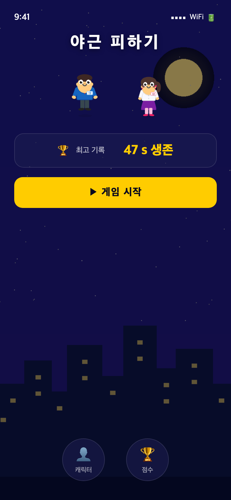
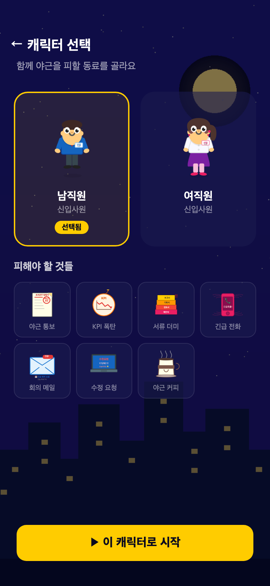
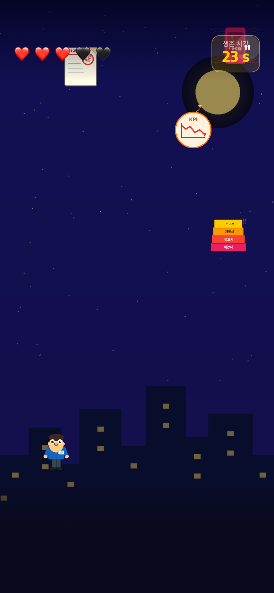

# 칼퇴왕 — Avoid Overtime!

> A Flutter × Unity WebGL mobile game where an office worker dodges falling workload objects to escape before overtime hits.

<p align="center">
  
  
  
</p>

> The screenshots above are rendered mockups using the actual game assets.
> For real device screenshots, run the Flutter app on a physical iOS or Android device.

[](https://flutter.dev)
[](https://dart.dev)
[](https://unity.com)
[](https://flutter.dev/docs/deployment/ios)

---

## What is this?

**칼퇴왕** ("King of Leaving Work On Time") is a mobile endless-dodge game built on a non-obvious tech stack: a Flutter shell app that embeds a Unity WebGL game inside an in-app WebView, with a bidirectional JavaScript bridge connecting the two.

You play as an office worker. Objects fall from the top of the screen — overtime notices, KPI bombs, urgent phone calls, document piles, meeting mails, revision laptops, overwork coffees. Dodge them all. Each hit costs a heart. Lose all five and it's another night at the office.

The core engineering challenge: Flutter and Unity don't talk to each other natively. This project solves it by running Unity as a WebGL build served by a local HTTP server inside the Flutter app, then wiring a JS bridge so Flutter can send game commands and Unity can stream back score and game-state events in real time.

---

## Features

- **Endless dodge gameplay** with progressive difficulty — falling speed ramps from 3 m/s to 9 m/s over 30 seconds, spawn interval from 1.5s to 0.5s
- **5-heart lives system** — character sprite changes state (normal → hit → burnout → fall) as hearts are lost
- **Character selection** — male or female office worker, each with a full set of state sprites
- **7 obstacle types** — each with its own sprite and per-type speed multiplier
- **Real-time score streaming** — Unity pushes the score to Flutter every second via JS bridge
- **Score history** — all past sessions saved locally with `shared_preferences`
- **Animated splash screen** — animated progress bar before launching to home
- **Flutter / browser dual mode** — the same Unity `index.html` detects whether it's inside a Flutter WebView or a desktop browser and adapts accordingly

---

## Tech Stack

| Layer | Technology |
|---|---|
| Mobile shell | Flutter 3.x (Dart SDK ^3.11.4) |
| State management | flutter_bloc ^8.1.6 + Equatable |
| WebView | flutter_inappwebview ^6.1.5 |
| Local asset server | InAppLocalhostServer (port 8080) |
| Game engine | Unity 6 (6000.4.3f1) |
| Build target | WebGL — WASM, compression disabled |
| Flutter → Unity | `evaluateJavascript` → `unityInstance.SendMessage` |
| Unity → Flutter | C# `DllImport` → `bridge.jslib` → `callHandler` |
| Persistence | shared_preferences ^2.3.5 |
| Typography | Pretendard (Regular 400, Bold 700, ExtraBold 800) |

---

## Architecture

```
┌─────────────────────────────────────────────────────────┐
│                  Flutter App (Dart)                      │
│                                                          │
│  SplashScreen → HomeScreen → CharacterSelectScreen       │
│                                   ↓                      │
│              GamePage  ←──────────────────               │
│  ┌─────────────────────────────────────────────────────┐ │
│  │  InAppLocalhostServer :8080  (serves assets/unity/) │ │
│  │  InAppWebView  →  http://localhost:8080/index.html  │ │
│  └──────────────────────┬──────────────────────────────┘ │
│                         │ evaluateJavascript             │
│     Flutter HUD overlay │ startGame / restartGame        │
│     (lives, score,      │ setCharacter / pause           │
│      game-over dialog)  │                                │
│                         │ callHandler ←──────────────────┤
│                         │ onUnityReady / onScoreUpdate   │
│                         │ onGameOver / onBurnout         │
└─────────────────────────┼──────────────────────────────-─┘
                          │
┌─────────────────────────┴──────────────────────────────┐
│               WebView — index.html                      │
│                                                         │
│  bridge.jslib  ←  C# DllImport  ←  GameManager.cs      │
│       ↓                                                 │
│  window.flutter_inappwebview.callHandler(...)           │
│                                                         │
│  Unity Runtime (WASM ~29MB)                             │
│    GameManager    ObjectSpawner    PlayerController     │
│    FallingObject  BackgroundScroller                    │
└─────────────────────────────────────────────────────────┘
```

### Bridge message table

| Direction | Event | Path |
|---|---|---|
| Flutter → Unity | Start / Restart game | `evaluateJavascript` → `flutterStartGame()` → `SendMessage('GameManager', ...)` |
| Flutter → Unity | Set character | `evaluateJavascript` → `flutterSetCharacter(name)` → `SendMessage(...)` |
| Flutter → Unity | Pause / Resume | `evaluateJavascript` → `flutterPause()` → `SendMessage(...)` |
| Unity → Flutter | Unity ready | `bridge.jslib` → `callHandler('onUnityReady')` |
| Unity → Flutter | Score tick | `SendScoreToFlutter(int)` → `callHandler('onScoreUpdate', score)` |
| Unity → Flutter | Lives update | `SendBurnoutToFlutter(current, max)` → `callHandler('onBurnout', ...)` |
| Unity → Flutter | Game over | `SendGameOverToFlutter(score, best)` → `callHandler('onGameOver', ...)` |

---

## Project Structure

```
flutter-unity-webgl-game/
├── unity-game/
│   └── Assets/
│       ├── Scripts/
│       │   ├── GameManager.cs        # Game state, score, Flutter bridge DllImport
│       │   ├── PlayerController.cs   # Rigidbody2D horizontal movement, sprite states
│       │   ├── ObjectSpawner.cs      # Object pooling, speed ramp (3→9 m/s / 30s)
│       │   └── FallingObject.cs      # Per-obstacle fall velocity + auto-despawn
│       ├── Editor/
│       │   ├── SceneSetup.cs         # Builds the entire scene from code (no Inspector)
│       │   ├── WebGLBuildScript.cs   # Applies WebGL build settings
│       │   └── BatchBuild.cs         # CLI entry point for -executeMethod
│       ├── Plugins/WebGL/
│       │   └── bridge.jslib          # JS functions called from C# DllImport
│       └── Sprites/                  # Character states + all 7 obstacle types
│
└── flutter-app/
    ├── lib/
    │   ├── main.dart                 # Portrait lock, app entry point
    │   ├── features/
    │   │   ├── splash/               # Animated loading screen
    │   │   ├── home/                 # Home screen, best score display
    │   │   ├── character_select/     # Male / female picker
    │   │   ├── game/                 # WebView + JS bridge + Flutter HUD overlay
    │   │   └── score/                # Game history list
    │   ├── core/
    │   │   ├── constants/            # AppColors, AppSpacing, AppTextStyles (design tokens)
    │   │   ├── widgets/              # AppButton, AppCard, AppDialog (shared components)
    │   │   └── router/               # Navigator setup
    │   └── data/
    │       ├── models/               # GameRecord
    │       └── repositories/         # ScoreRepository (shared_preferences)
    └── assets/
        ├── unity/                    # index.html + Build/ (loader, framework, data, wasm)
        ├── images/                   # Character sprites + background (mirrored from Unity)
        └── fonts/                    # Pretendard (400, 700, 800)
```

---

## Getting Started

### Prerequisites

| Tool | Version |
|---|---|
| Flutter SDK | ≥ 3.11.4 |
| Dart SDK | ≥ 3.11.4 |
| Xcode (iOS) | ≥ 15 |
| Android Studio | Any recent |
| Unity (optional, to rebuild) | 6000.4.3f1 |
| Python 3 (to preview Unity game in browser) | any |

### 1. Clone

```bash
git clone https://github.com/jaekyung-you/flutter-unity-webgl-game.git
cd flutter-unity-webgl-game
```

### 2. Preview the Unity game in a browser (no device needed)

```bash
cd unity-game/Builds/WebGL
python3 -m http.server 9090
# Open http://localhost:9090 — click START to play
```

This mode shows the HTML overlay (START / RESTART buttons). The Flutter HUD is not present here — that runs only in the native app.

### 3. Run the Flutter app (physical device required)

> **iOS Simulator and Android Emulator do not support WebGL/WASM hardware acceleration.** A real device is required.

```bash
cd flutter-app
flutter pub get
flutter run    # connect a physical iOS or Android device via USB
```

For iOS, make sure your device is trusted and you have a valid signing certificate set in Xcode.

---

## Rebuilding the Unity WebGL Build

### Using the Unity Editor menu

1. Open `unity-game/` in Unity 6 (6000.4.3f1 or later)
2. Run **Unity → Build → Setup Game Scene** to regenerate the scene from code
3. Run **Unity → Build → Build WebGL** to compile
4. Copy the output from `unity-game/Builds/WebGL/` into `flutter-app/assets/unity/`

### Using CLI batch mode

```bash
/path/to/Unity \
  -batchmode \
  -projectPath unity-game \
  -executeMethod BatchBuild.BuildWebGL \
  -quit \
  -logFile build.log
```

> **WebGL compression must stay disabled.** `flutter_inappwebview`'s `InAppLocalhostServer` does not serve Brotli or gzip `Content-Encoding` headers, so compressed builds will fail to load.

---

## Implementation Highlights

### Race condition: wait for the local server before mounting the WebView

```dart
// game_page.dart
await _localServer!.start();
setState(() => _serverReady = true);  // WebView only renders after this
```

### Unity → Flutter score stream

```csharp
// GameManager.cs
[DllImport("__Internal")]
private static extern void SendScoreToFlutter(int score);
```

```js
// bridge.jslib
SendScoreToFlutter: function(score) {
  window.flutter_inappwebview.callHandler('onScoreUpdate', score);
}
```

### Flutter → Unity game control

```dart
// game_page.dart
_webController?.evaluateJavascript(source: 'window.flutterStartGame();');
```

```js
// index.html
window.flutterStartGame = function() {
  window.unityInstance.SendMessage('GameManager', 'OnFlutterStartGame', '');
};
```

### Flutter / browser dual mode detection

`index.html` checks for `window.flutter_inappwebview` at load time. Inside the Flutter WebView the plugin injects that object, so the script calls `callHandler('onUnityReady')`. In a plain browser the object is absent, so the HTML overlay (START / RESTART buttons) renders instead.

---

## Known Limitations

| Issue | Detail |
|---|---|
| Physical device only | iOS Simulator and Android Emulator don't support WebGL/WASM acceleration |
| Initial load time | ~10–20 seconds on a physical device (WASM bundle is ~29 MB) |
| No compression | WebGL compression is disabled; enabling it breaks the local server |
| Landscape layout | App is locked to portrait; landscape is not currently supported |

---

## Screenshots

Three rendered mockups using the real game sprites are in `docs/screenshots/`:

| Home | Character Select | Gameplay |
|---|---|---|
|  |  |  |

To capture real device screenshots (showing the full Flutter HUD and smooth animations), run the app on a physical iOS or Android device and screenshot from the device.

To preview the Unity game standalone in a browser (no Flutter HUD, shows HTML overlay buttons instead):

```bash
cd unity-game/Builds/WebGL
python3 -m http.server 9090
# Open http://localhost:9090
```

---

## License

MIT — see [LICENSE](LICENSE) for details.
